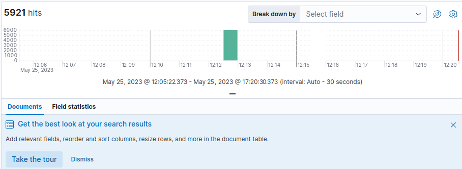

# Лабораторная работа №3. Развертывание системы мониторинга ELK Stack (Opensearch)

## Цель работы

1. Освоить базовые подходы централизованного сбора и накопления информации
2. Освоить современные инструменты развертывания контейнирозованных приложений
3. Закрепить знания о современных сетевых протоколах прикладного уровня

## Задание

1. Развернуть систему мониторинга на базе Opensearch
- Opensearch
- Beats (Filebeat, Packetbeat)
- OpenSearch Dashboards
2. Настроить сбор информации о сетевом трафике
3. Настроить сбор информации из файлов журналов (лог-файлов)
4. Оформить отчет в соответствии с шаблоном

## Исходные данные

- Windows 10
- Docker
- WSL2 (Ubuntu 20.04)
- RStudio

## Ход работы

1. Используем последовательность команд:

```
docker pull docker.elastic.co/elasticsearch/elasticsearch:8.8.0
```

```
wsl -d docker-desktop -u root
```

```
sysctl -w vm.max_map_count=262144
```

```
docker run --name es01 --net elastic -p 9200:9200 -it docker.elastic.co/elasticsearch/elasticsearch:8.8.0
```

2. Настраиваем файлы конфигурации: docker-compose.yml, filebeat.yml, packetbit.yml, .env. Все файлы лежат в директории <i>Files</i>

3. Запускаем контейнер с использованием настроенных файлов

```
docker-compose up -d
```

4. С помощью пароля, установленного в <i>.env</i> входим в пользователя <i>elastic</i> по адресу http://localhost:5601/

5. Просматриваем filebeat и packetbeat при помощи инструментария Elastic (рисунки 1 и 2)



Рисунок 1 - Просмотр filebeat


Рисунок 2 - Просмотр packetbeat

## Выводы

В ходе выполнения работы была изучена и развернута система мониторинга на базе ELK Stack, с использованием Opensearch в качестве поискового и аналитического движка. Были освоены следующие навыки:

- Установка и настройка Opensearch
- Установка и настройка Kibana
- Сбор и отправка данных в Opensearch
