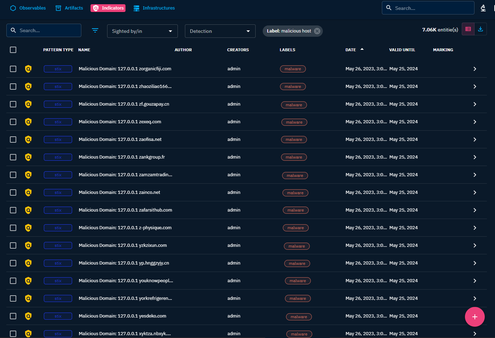

# Лабораторная работа №4. Развертывание Threat intelligence Platform OpenCTI

## Цель работы

1. Освоить базовые подходы процессов Threat Intelligence
2. Освоить современные инструменты развертывания контейнирозованных приложений
3. Получить навыки поиска информации об угрозах ИБ

## Задание

1. Развернуть систему threat intelligence – Open CTI https://www.opensourceagenda.com/projects/opencti
2. Настроить дополнительные источники информации об угрозах ИБ (один или несколько дополнительных фидов) – например, https://github.com/openctibr/threatFeeds
3. Проверить наличие индикаторов компрометации в собранном в ПР №3 наборе данных (метаданные
траффика).

## Исходные данные

- Windows 10
- Docker
- ElasticSearch
- WSL2 (Ubuntu 20.04)
- RStudio
- Google Colab

## Ход работы

1. Изменяем файлы <i>.env</i> и <i>docker-compose.yml</i> из прошлой ЛР
2. Запускаем контейнер с использованием заново настроенных файлов
```
docker-compose up -d
```
3. Входим в аккаунт на странице http://localhost:8080/ с данными из файла <i>.env</i>

EMAIL: admin@opencti.io

PASSWORD: adminopencti

4. Открываем Google Colab и выполняем следующий код для файла <i>hosts.txt</i> из ЛР №2
  
```
!pip install stix2

import json
import stix2

hosts_file = open('hosts.txt', 'r')
domains = hosts_file.read().splitlines()
hosts_file.close()

indicators = []
for domain in domains:
    domain = domain.strip()
    if not domain:
        continue
    try:
        indicator = stix2.Indicator(
            name=f"Malware: {domain}",
            pattern="[domain-name:value = '{}']".format(domain),
            pattern_type="stix",
            labels=['malware'])
        indicators.append(indicator)
    except stix2.exceptions.InvalidValueError:
        print(f"Invalid domain: {domain}")
        continue

bundle = stix2.Bundle(objects=indicators)

output_file = open('newHost.json', 'w')
json.dump(bundle.serialize(), output_file, indent=4)
output_file.close()
```

5. Загружаем полученный файл <i>newHosts.json</i> из ЛР №2 (Data import and analyst workbenches)
5. Делаем файл доступным для просмотра (Validate this workbench)
6. Переходим во вкладку Observations - Indicators и смотрим результат


Рисунок 1 - Нежелательные хосты

## Вывод

После выполнения работы в купе с полученными навыками из лабораторной работы №2 были приобрены навыки по развертыванию и настройке платформы OpenCTI для обработки информации о киберугрозах, а таке по сбору, анализу и визуализации различных видов угрозной информации, включая индикаторы
